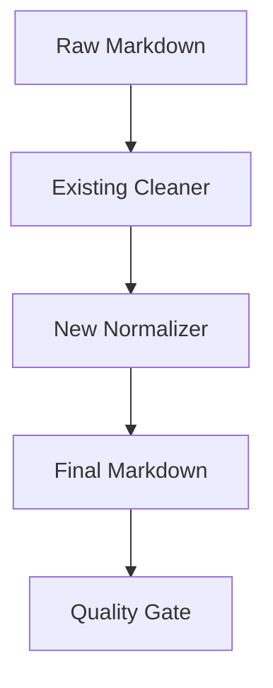

# Design: Post-OCR Markdown Normalization ✨

## Architecture
A normalização será integrada ao `cleaner.py` e executada na fase final da conversão (`converter.py`), antes de passar pelo `quality_gate.py`.

A função `normalize_technical_artifacts` será adicionada ao `cleaner.py`. Ela aplicará regexes conservadoras para remover resíduos técnicos.

## Technical Artifacts to Remove
1. `*[Image OCR]`: Marcador auxiliar de imagem injetado por alguns backends de OCR.
2. `## Page N`: Cabeçalhos não canônicos injetados por ferramentas de conversão nativa ou OCR.
3. `\[\[Pág. N\]\] <!-- método: ... -->`: O comentário de método já é removido pelo Quality Gate (que falha se encontrar), mas deve ser removido pelo normalizador para garantir conformidade.

## Implementation Details

### src/pipeline_juridico/cleaner.py
- Adicionar `_OCR_IMAGE_PATTERN = re.compile(r"\*\s*\[Image OCR\]", re.IGNORECASE)`
- Adicionar `_NON_CANONICAL_PAGE_HEADER = re.compile(r"^#+\s*Page\s*\d+$", re.IGNORECASE | re.MULTILINE)`
- Adicionar função `normalize_technical_artifacts(markdown: str) -> str`.

### src/pipeline_juridico/quality_gate.py
- Atualizar `evaluate` para verificar a presença de `*[Image OCR]` e `## Page N`. Se presentes, o estado deve ser `FAIL`.

## Directory Structure
Nenhuma alteração estrutural.

## Schema
Nenhuma alteração nos modelos de dados.

## Risks and Mitigations
- **Risco**: Remoção acidental de conteúdo jurídico que contenha "Page" ou "Image OCR".
- **Mitigação**: Usar regexes estritas. `## Page N` só será removido se for um cabeçalho isolado. `*[Image OCR]` será removido apenas com a sintaxe exata do artefato.
