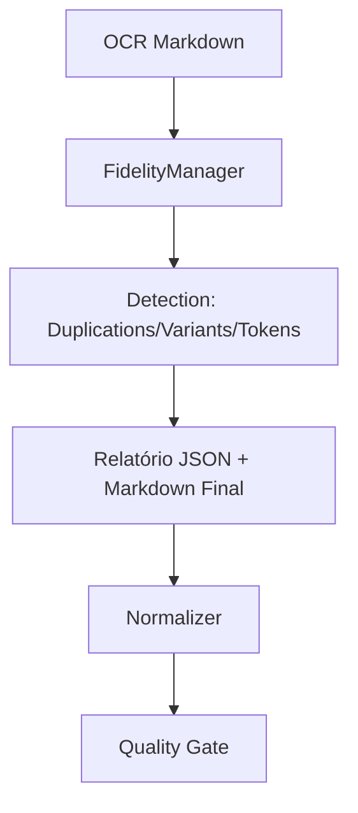

# Design: OCR Fidelity and Uncertainty Control ✨

## Architecture
A fidelidade será controlada por um novo componente `FidelityManager` no módulo `fidelity.py`. Ele será integrado ao `converter.py` para analisar a saída do OCR antes da normalização final.



## Detection Strategies

1.  **Duplication Detection**: Busca por repetição substancial interna dentro da mesma página (min 100 chars), normalizando apenas whitespace.
2.  **Entity Consistency**: Uso de distância de Levenshtein conservadora para detectar nomes ou identificadores com variações mínimas (1 char), excluindo palavras jurídicas comuns.
3.  **Sensitive Token Monitoring**: Monitoramento determinístico de padrões sensíveis (ex: confusão § vs 8).
4.  **Uncertainty Signaling**: Identificação de mistura alfanumérica suspeita e ruído de linha, sem mutação automática do Markdown.

## Implementation Details

### src/pipeline_juridico/models.py
Adicionar suporte ao relatório de auditoria de fidelidade.

```python
@dataclass
class FidelityIssue:
    issue_type: str  # duplication, entity_inconsistency, sensitive_token_uncertainty, visual_uncertainty
    detector: str
    page_number: int
    offset_start: Optional[int] = None
    offset_end: Optional[int] = None
    size: Optional[int] = None
    fingerprint: Optional[str] = None
    resolution: str = "flagged"  # accepted, flagged, illegible, double_checked

@dataclass
class FidelityAudit:
    issues: List[FidelityIssue] = field(default_factory=list)
```

### src/pipeline_juridico/fidelity.py (Novo)
*   `detect_duplications(text: str) -> List[FidelityIssue]`
*   `check_entity_consistency(text: str, context: dict) -> List[FidelityIssue]`
*   `monitor_sensitive_tokens(text: str) -> List[FidelityIssue]`
*   `apply_fidelity_controls(markdown: str, page_number: int) -> tuple[str, FidelityAudit]`

### src/pipeline_juridico/converter.py
Integrar a chamada ao `fidelity.py` após a conversão de cada página.

### src/pipeline_juridico/quality_gate.py
Adicionar validação para garantir que o `fidelity_audit` esteja presente no JSON e que inconsistências graves resultem em `WARNING` ou `FAIL` conforme configurado.

## Directory Structure
Nenhuma alteração.

## Schema
O `Relatorio` JSON incluirá um novo campo `fidelity_audit` dentro de cada entrada de `pages`.

## Risks and Mitigations
*   **Risco**: Falsos positivos em nomes que realmente mudam um caractere (raro em nomes próprios mas possível em códigos).
*   **Mitigação**: O sistema apenas SINALIZA no relatório JSON e usa `[[ilegível]]` apenas em casos de alta incerteza visual, nunca alterando o nome por inferência.
*   **Risco**: Custo computacional de análise de texto.
*   **Mitigação**: Usar algoritmos eficientes de busca de strings e limitar o escopo de comparação.
